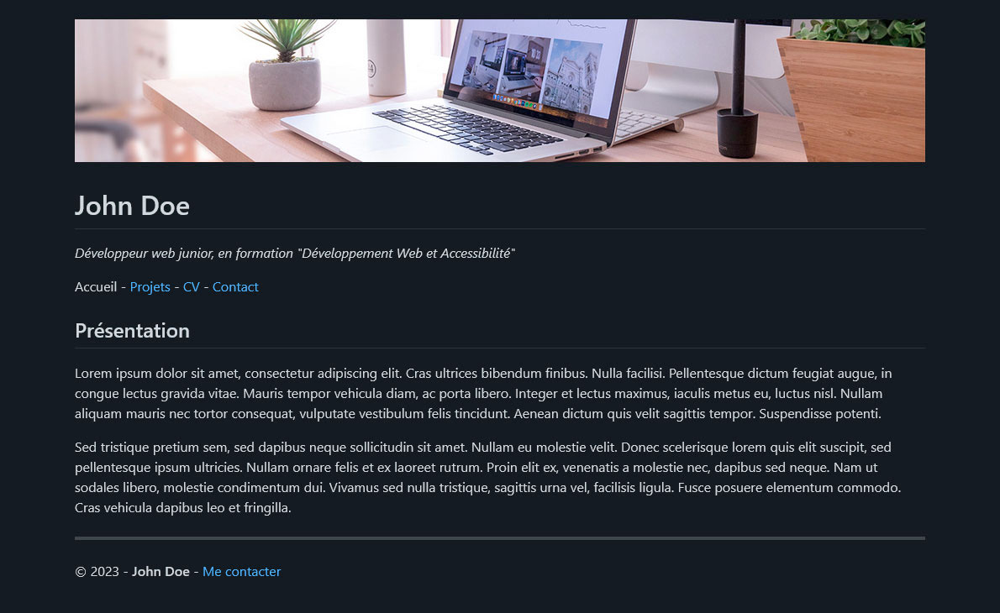
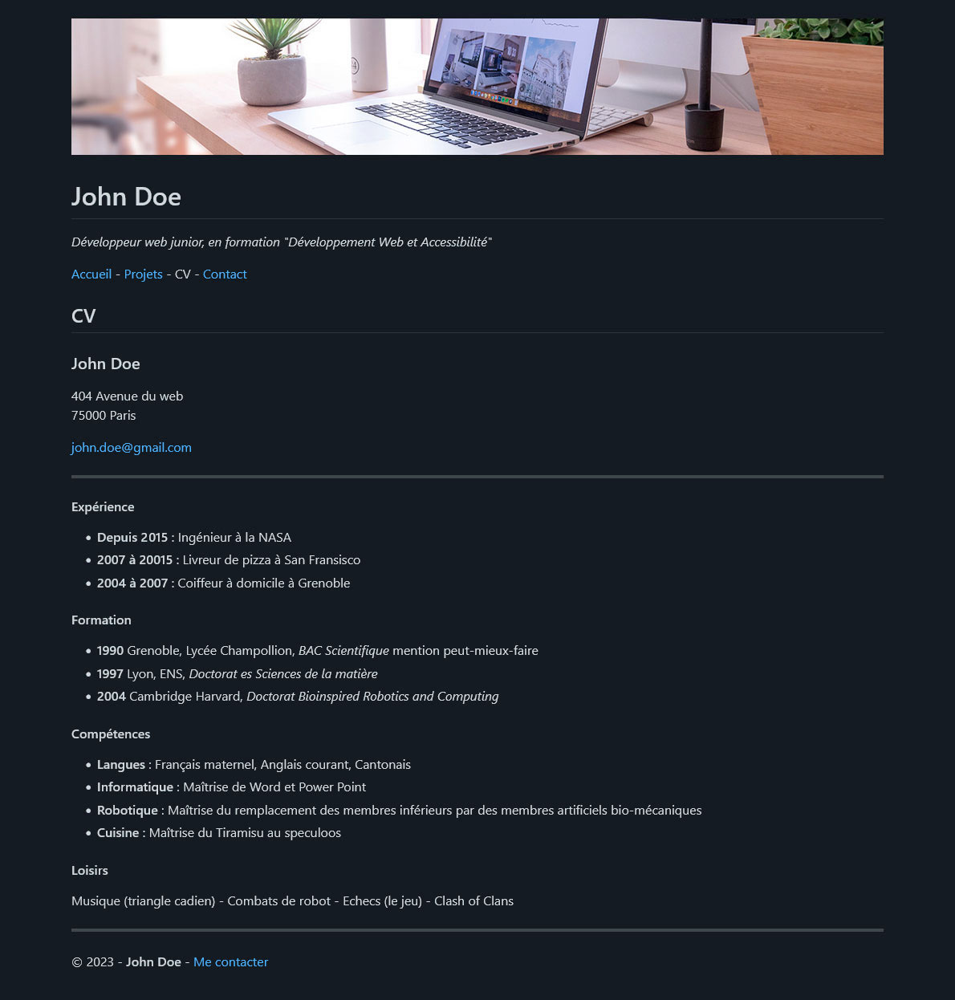
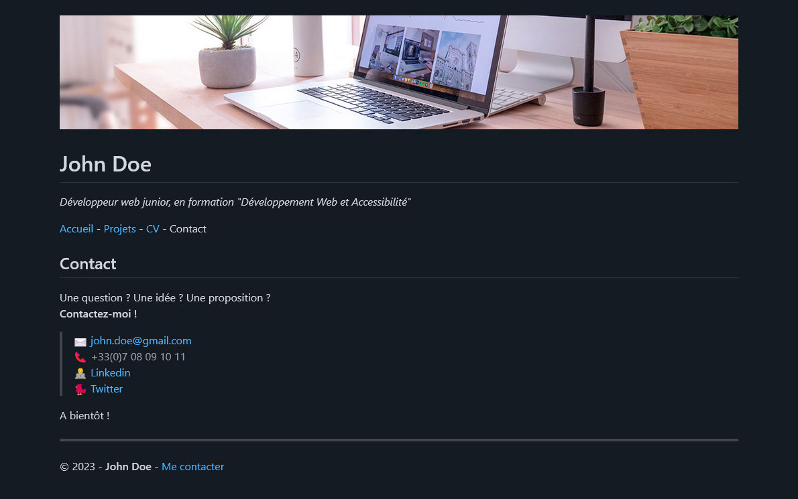

# Atelier récap - Markdown, Terminal, Git et VSCode

On en a vu des choses ces derniers jours :smile:

Dans cet atelier, on va remettre tout ça en pratique en créant notre premier site web :scream:

Bon, pour le moment, le site ne sera accessible que depuis l'interface de GitHub, mais ce sera déjà pas mal :stuck_out_tongue:

:information_source: Les étapes de l'énoncé ne sont pas trop guidées volontairement. :information_source:

En cas de blocage, voici la marche à suivre :
1. Chercher l'information par toi même (documentation, Google...)
2. Demander de l'aide à la promo
3. Demander de l'aide au tuteur ou prof ou les 2 :wink:

## :toolbox: 1. On prépare le projet

*Première étape : on prépare le projet avant de coder.*

### Sur GitHub

1. Connecte toi sur ton compte GitHub et créé un dépôt publique `S01E11-Atelier-Recap` avec un README
2. Une fois le dépôt créé, rends toi à la racine de celui-ci et copie l'adresse SSH qui doit ressembler à `git@github.com:ton-pseudo-github/S01E11-Atelier-Recap.git`

### Sur ta VM

1. Ouvre GitBash (le terminal) et rends-toi là ou tu souhaites stocker l'atelier du jour (par exemple dans `Utilisateurs/toto/Documents/Qilin-DWA/S01/E11`). 
Pour rappel, afin de te déplacer dans les répertoires, tu peux utiliser la commande `cd` (changer de répertoire).
2. Clone ton dépôt précédemment créé avec la commande `git clone`
3. Tu as normalement créé un dossier (presque) vide nommé `S01E11-Atelier-Recap`, vérifie qu'il existe bien dans le répertoire courant avec la commande `ls` (lister les fichiers)
4. Toujours dans le terminal, rentre dans le répertoire du projet avec la commande `cd S01E11-Atelier-Recap` puis ouvre le répertoire dans VSCode avec la commande `code .` (ouvrir le répertoire courant dans VSCode)

*C'est bon, nous sommes prêts à travailler* :tada:

## 🏠 2. On code la page d'accueil

*Deuxième étape, utiliser VSCode pour coder notre première page*

1. Actuellement, le projet ne contient que le fichier `README.md` (toujours dans le répertoire courant).
2. Code ta page au format Markdown afin qu'elle ressemble à la maquette ci-dessous
    * tu peux modifier le contenu à ta guise
    * les liens sont vides pour le moment
    * tu peux récupérer l'image du haut [ici](img/desk-banner.jpg)

> 

## 💾 3. On sauvegarde son travail sur GitHub

*Actuellement, ton travail est uniquement sur ta VM. Pour sauvegarder ta page d'accueil, on va l'envoyer sur le dépôt GitHub 🚀*

1. Dans le terminal, à la racine du projet, tape la commande `git add .` pour préparer tous les fichiers du projet à l'envoi (un peu comme si tu remplissait un colis avec des objets à envoyer)
2. Puis tape la commande `git commit -m "page d'accueil"` pour créer un nouveau commit (un peu comme si tu collais une étiquette qui décrit ce qu'il y a à l'intérieur du colis avant de le refermer)
3. Enfin, tape la commande `git push` qui te permet de pousser le commit vers le dépôt remote (un peu comme si tu envoyais le colis chez GitHub)

👀 Si tout s'est bien passé, tu devrais voir le rendu de ta page d'accueil à la racine de ton dépôt GitHub, à l'adresse `https://github.com/ton-pseudo-github/S01E11-Atelier-Recap/`

## 📚 4. On code la page `Projets`

*Toujours en Makdown, on créé la deuxième page du site*

1. Créé un nouveau ficher `projets.md`
2. Code ta page pour quelle ressemble à la maquette ci-dessous (tu es toujours libre sur le contenu)

> 

## 🔗 5. On créé des liens

*Super, on a maintenant 2 pages, il manque un moyen de naviguer d'une page à l'autre*

### Dans le fichier `README.md`

Ajoute un lien vers la page `Projets` (`projets.md`) au niveau du menu de navigation (voir image ci-dessous)

> 

### Dans le fichier `projets.md`

Ajoute un lien vers la page d'accueil (`README.md`) au niveau du menu de navigation

## 💾 6. On sauvegarde son travail sur GitHub

1. Dans le terminal, à la racine du projet, tape la commande `git add .` pour préparer tous les fichiers du projet à l'envoi (un peu comme si tu remplissait un colis avec des objets à envoyer)
2. Puis tape la commande `git commit -m "page projets"` pour créer un nouveau commit (un peu comme si tu collais une étiquette qui décrit ce qu'il y a à l'intérieur du colis avant de le refermer)
3. Enfin, tape la commande `git push` qui te permet de pousser le commit vers le dépôt (un peu comme si tu envoyais le colis chez GitHub)

👀 Comme précédemment, tu peux vérifier tes mofifications sur GitHub et t'assurer que les liens entre les pages fonctionnent

## 🚲 7. On code les pages CV et Contact

Maintenant que tu as compris le principe, inspire toi des étapes précédentes pour créer les 2 pages restantes librement.

⚠️ N'oublies pas de créer les liens entre les différentes pages et commiter à chaque modification 😄

Voici les 2 dernieres maquettes pour t'inspirer :

> 

> 
